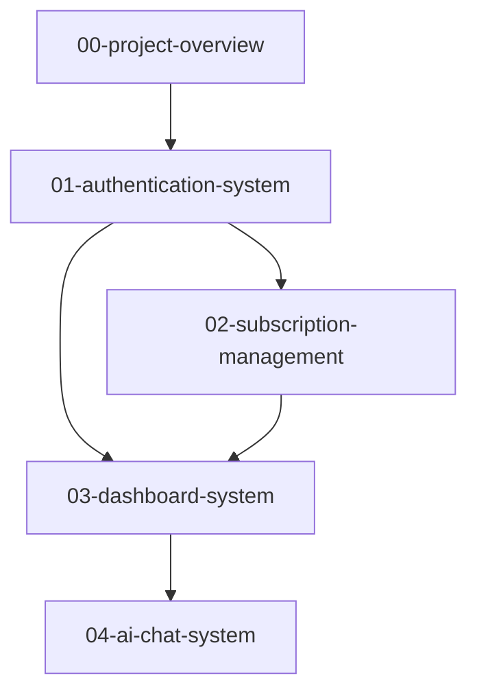

# React Starter Kit (RSK) - Kiro Specifications

This directory contains comprehensive Kiro specifications for the React Starter Kit project, following Kiro documentation best practices for clear, actionable specifications that enable effective AI assistance and maintain code quality.

## Specification Overview

The specifications are organized into focused, modular specs that cover different aspects of the application architecture. Each spec follows the Kiro pattern of `requirements.md`, `design.md`, and `tasks.md` files.

## Specification Structure

### 00-project-overview/
**Purpose**: High-level project vision, architecture, and implementation roadmap
- `requirements.md` - Project goals, technology stack, and success metrics
- `design.md` - System architecture, integration patterns, and technical design
- `tasks.md` - Project phases, milestones, and implementation timeline

### 01-authentication-system/
**Purpose**: User authentication and authorization using Clerk + Convex
- `requirements.md` - Authentication flows, security requirements, and user stories
- `design.md` - Authentication architecture, data flow, and integration patterns
- `tasks.md` - Implementation tasks for complete authentication system

### 02-subscription-management/
**Purpose**: Payment processing and subscription management using Polar.sh
- `requirements.md` - Billing requirements, payment flows, and compliance needs
- `design.md` - Payment architecture, webhook processing, and data models
- `tasks.md` - Implementation tasks for subscription and billing features

### 03-dashboard-system/
**Purpose**: User dashboard with real-time data and responsive design
- `requirements.md` - Dashboard functionality, UX requirements, and performance needs
- `design.md` - Component architecture, real-time patterns, and UI/UX design
- `tasks.md` - Implementation tasks for complete dashboard system

### 04-ai-chat-system/
**Purpose**: AI-powered chat with OpenAI integration and real-time streaming
- `requirements.md` - Chat functionality, AI integration, and user experience needs
- `design.md` - Chat architecture, streaming patterns, and file processing
- `tasks.md` - Implementation tasks for AI chat features

## Technology Stack Integration

### Frontend Architecture
- **React Router v7**: Full-stack React framework with SSR
- **TypeScript**: End-to-end type safety
- **TailwindCSS v4**: Modern utility-first styling
- **shadcn/ui**: Accessible component library built on Radix UI

### Backend Architecture
- **Convex**: Real-time database with serverless functions
- **Clerk**: Authentication and user management
- **Polar.sh**: Subscription billing and payments
- **OpenAI**: AI chat capabilities

### Deployment
- **Vercel**: Primary deployment platform with React Router preset
- **Docker**: Alternative containerized deployment option

## Key Design Principles

### 1. Component-First Development
Build UI components in isolation before application assembly, following the established patterns in the existing codebase.

### 2. Real-time Data Flow
Leverage Convex subscriptions for live data updates across all features, ensuring consistent user experience.

### 3. Type-Safe Architecture
Maintain end-to-end TypeScript safety from database schema to UI components.

### 4. Security by Design
Implement security best practices at every layer, from authentication to data handling.

### 5. Performance Optimization
Optimize for fast loading, smooth interactions, and efficient resource usage.

## Implementation Guidelines

### Development Workflow
1. **Planning Phase**: Review requirements and design documents
2. **Implementation Phase**: Follow task breakdowns with clear acceptance criteria
3. **Testing Phase**: Implement comprehensive testing at unit, integration, and E2E levels
4. **Review Phase**: Conduct code reviews focusing on security and performance

### Code Quality Standards
- **File Size Limit**: Maximum 150 lines per component file
- **Type Safety**: Strict TypeScript configuration
- **Testing**: 90%+ code coverage requirement
- **Documentation**: Clear JSDoc comments for public APIs

### Integration Patterns
- **Authentication**: Clerk + Convex integration for user management
- **Real-time**: Convex subscriptions for live data updates
- **Payments**: Polar.sh webhook processing with Convex storage
- **AI**: OpenAI streaming responses with real-time UI updates

## Specification Dependencies

### Implementation Order
1. **Authentication System** - Foundation for all protected features
2. **Subscription Management** - Required for feature access control
3. **Dashboard System** - Core user interface and navigation
4. **AI Chat System** - Advanced feature requiring all previous systems

## File References and Context

### Key Configuration Files
- `#[[file:package.json]]` - Project dependencies and scripts
- `#[[file:react-router.config.ts]]` - React Router and Vercel configuration
- `#[[file:convex/schema.ts]]` - Database schema definitions
- `#[[file:app/root.tsx]]` - Application root with providers

### Core Application Structure
- `#[[file:app/routes/]]` - Application routing and page components
- `#[[file:app/components/]]` - Reusable UI components organized by feature
- `#[[file:convex/]]` - Backend functions and database operations
- `#[[file:public/]]` - Static assets and resources

### Documentation Files
- `#[[file:README.md]]` - Project overview and getting started guide
- `#[[file:SETUP.md]]` - Detailed setup instructions
- `#[[file:DEPLOYMENT.md]]` - Production deployment guide
- `#[[file:PROJECT_SUMMARY.md]]` - Current project status and configuration

## Usage Guidelines

### For Developers
1. **Start with Requirements**: Understand user needs and acceptance criteria
2. **Review Design**: Study architecture patterns and integration approaches
3. **Follow Tasks**: Implement features using the structured task breakdowns
4. **Maintain Quality**: Adhere to code quality standards and testing requirements

### For AI Assistance
1. **Context Awareness**: Reference relevant spec files for context
2. **Pattern Consistency**: Follow established patterns from existing codebase
3. **Incremental Development**: Implement features in small, testable increments
4. **Quality Focus**: Prioritize security, performance, and accessibility

### For Project Management
1. **Milestone Tracking**: Use spec phases for project milestone planning
2. **Resource Planning**: Reference task estimates for resource allocation
3. **Risk Management**: Consider dependencies and technical constraints
4. **Quality Gates**: Use acceptance criteria for feature completion validation

## Maintenance and Updates

### Specification Evolution
- **Regular Reviews**: Update specs based on implementation learnings
- **Version Control**: Track spec changes alongside code changes
- **Stakeholder Input**: Incorporate feedback from development team and users
- **Best Practice Updates**: Evolve specs based on Kiro documentation updates

### Integration with Development
- **Code Reviews**: Reference specs during code review process
- **Testing Validation**: Ensure tests align with spec requirements
- **Documentation Sync**: Keep implementation docs in sync with specs
- **Performance Monitoring**: Validate that implementation meets spec performance requirements

## Getting Started

1. **Read Project Overview**: Start with `00-project-overview/requirements.md`
2. **Understand Architecture**: Review `00-project-overview/design.md`
3. **Plan Implementation**: Follow `00-project-overview/tasks.md` for project phases
4. **Implement Features**: Work through individual feature specs in dependency order

For detailed implementation guidance, refer to the individual specification directories and their respective requirements, design, and task documents.